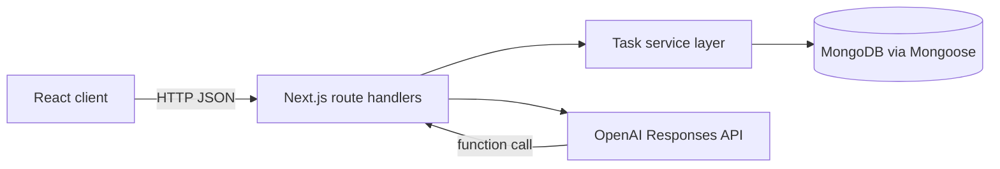
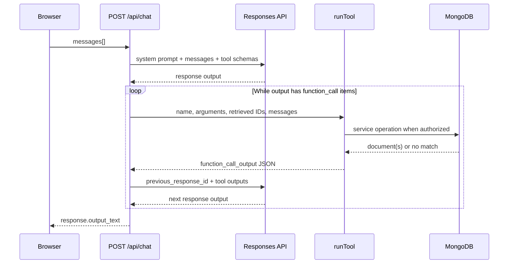

# do Architecture

This reference describes the implementation in this repository. It distinguishes model proposals from database writes, because that boundary is the central safety and product decision in `do`.

## Application Shape

The app is a Next.js App Router application. [`app/page.tsx`](../app/page.tsx) renders the client-side `DoApp`, which switches between the task workspace and chat workspace. The browser communicates only with route handlers under `app/api`; those handlers use services under `lib/services`, which are the only application layer that directly uses the Mongoose model.



This split keeps database access out of the client and makes both the REST routes and AI tools use the same persistence functions.

## Text Extraction to Human Review

The task-generation workflow uses AI to identify work but leaves persistence to the person using the app:

1. `DoApp.generate()` posts `{ "text": notes }` to `POST /api/todos/generate`.
2. The route calls `openai.responses.create` with a system instruction to extract actionable tasks and the single `createTodo` tool definition.
3. Each function call in `response.output` is parsed into a proposal. `toolCallId` is retained as a stable UI identity.
4. The client renders proposals with checkboxes. All are selected initially; the user may deselect or remove proposals.
5. `DoApp.save()` removes UI-only fields and posts the selected fields to `POST /api/todos`.
6. That route calls `saveTodo` once per item and returns the newly created documents.

The generate route does **not** run its function calls or invoke the service layer. Reusing `createTodoTool` there supplies a consistent task-shaped schema to the model, but it does not grant persistence by itself. This makes the review surface a real human-in-the-loop boundary instead of a cosmetic preview.

For example, text such as “Mina will send the proposal by 2026-09-25; Alex should review it” or “I want to learn TypeScript this month” can yield proposed tasks. They are not database tasks until selected and saved.

## Data and Persistence

[`lib/models/ToDo.ts`](../lib/models/ToDo.ts) declares one `Todo` Mongoose model. `title` is required and trimmed; `description`, `assignee`, and `dueDate` are optional. `status` is one of `in_progress`, `blocked`, or `completed`, with `in_progress` as the default. Schema timestamps provide `createdAt` and `updatedAt`.

[`lib/connection.ts`](../lib/connection.ts) reads `MONGODB_URI` and uses a `global.mongoose` cache containing a connection and in-flight promise. The cache prevents repeated connection setup across route executions and supports the module reloading typical of local development. A failed connection clears the cached promise so a later request can retry.

[`lib/services/index.ts`](../lib/services/index.ts) is a narrow data-access layer:

| Function                  | Operation and ordering                                                |
| ------------------------- | --------------------------------------------------------------------- |
| `createTodo` / `saveTodo` | Create a task document                                                |
| `getAllTodos`             | Find all tasks, newest `createdAt` first                              |
| `getTodosByStatus`        | Filter by status, then `dueDate` ascending and `createdAt` descending |
| `getTodosByDueDateRange`  | Inclusive `dueDate` range, then the same due-date ordering            |
| `updateTodo`              | `findByIdAndUpdate` with validators and the updated document returned |
| `deleteTodo`              | `findByIdAndDelete`                                                   |

Every function connects before its query. The service layer is intentionally small, but it centralizes the Mongoose calls so HTTP handlers and chat tools do not develop separate database behavior.

## REST Routes

The task routes are transport adapters over that service layer:

| Handler                    | Input validation                  | Service behavior                                  |
| -------------------------- | --------------------------------- | ------------------------------------------------- |
| `GET /api/todos`           | None                              | Returns all tasks                                 |
| `POST /api/todos`          | Requires `todos` to be an array   | Saves all entries concurrently with `Promise.all` |
| `POST /api/todos/generate` | Requires a truthy string `text`   | Produces non-persistent task proposals            |
| `PATCH /api/todos/:id`     | Valid ObjectId and a known status | Updates only `status`                             |
| `DELETE /api/todos/:id`    | No explicit ObjectId precheck     | Deletes the matching task when found              |

The bulk save route passes submitted objects to Mongoose rather than independently validating every task field. Mongoose enforces schema-required fields and enum validation. The status patch route validates its narrower input before calling the service. Route failures are logged on the server and returned as JSON error messages.

## OpenAI Tools and Application Functions

[`lib/ai/tools.ts`](../lib/ai/tools.ts) describes six OpenAI function tools. It contains schemas and model-facing instructions, but no database calls. [`app/api/chat/route.ts`](../app/api/chat/route.ts) is the executor that maps an emitted function name to a service function:

| Tool definition          | Executor action                                      | Service function         |
| ------------------------ | ---------------------------------------------------- | ------------------------ |
| `createTodo`             | Validates task fields, creates a task                | `createTodo`             |
| `updateTodo`             | Validates a retrieved ID and requested fields        | `updateTodo`             |
| `deleteTodo`             | Requires retrieval plus explicit confirmation        | `deleteTodo`             |
| `getAllTodos`            | Retrieves all tasks and remembers returned IDs       | `getAllTodos`            |
| `getTodosByStatus`       | Validates status and remembers returned IDs          | `getTodosByStatus`       |
| `getTodosByDueDateRange` | Validates inclusive calendar range and remembers IDs | `getTodosByDueDateRange` |

The schemas use `strict: false`, so server-side checks remain authoritative. This is important because a function tool definition guides model output but is not a security boundary. `runTool` parses tool JSON, validates types and values, and returns a serializable result or throws a plain error that is converted to tool output.

## Chat Assistant and Tool Loop

The client keeps a sequence of `{ role: "user" | "assistant", content }` messages in React state and posts the entire sequence for each turn. The server first validates that the conversation is nonempty and each message has a permitted role and nonblank string content.

The initial Responses API call receives a system message, conversation history, and all six tools. The system message directs the assistant to use tools when saved data is relevant, never infer a write from a question, retrieve before updating, and return HTML only.



Calls in one response execute concurrently with `Promise.all`. For each call, the route sends a `function_call_output` with the original `call_id`; successful values and errors are both serialized with `JSON.stringify`. It then continues the response with `previous_response_id` and those outputs. The loop ends only when the model returns no function calls, and `response.output_text` becomes the client-facing assistant message.

The loop matters because the model needs the actual retrieval or mutation result before it can answer accurately. The API does not treat a requested operation as successful merely because the model called a tool.

### Retrieval Before Modification

During a single chat request, retrieval tools add each returned task’s `_id` and title to a `Map`. `updateTodo` and `deleteTodo` require the supplied ID to be a valid MongoDB ObjectId **and** to appear in that map. This means the model must retrieve the specific saved task in the current request before it can alter it. It limits accidental mutations based on guessed or stale identifiers.

Chat can therefore:

- Retrieve all tasks, tasks in one status, or tasks in an inclusive date range.
- Create a task only after an explicit user instruction.
- Update title, description, assignee, due date, or status after retrieval and an explicit user instruction.
- Delete a retrieved task only after a confirmation exchange.

Chat messages are not stored. The retrieved-ID map is also request-local, so each new client turn must retrieve again before an update or delete.

### Delete Confirmation

Deletion through chat has defense in depth:

1. The system prompt instructs the model to retrieve, name the task, and ask for confirmation first.
2. The tool requires `confirmed: true`.
3. The executor requires the latest supplied message to be a user message matching one of `yes`, `confirm`, `confirmed`, `proceed`, `delete it`, or `remove it` as a word/phrase.
4. It also requires an earlier assistant message containing “confirm” or “confirmation” and the retrieved task title.

Only then does it call `deleteTodo`. These checks apply to the chat route. The normal task-list delete control directly calls `DELETE /api/todos/:id` and does not share this confirmation protocol.

## Dates, Groups, Filters, and Sorting

Chat-side date arguments must match `YYYY-MM-DD`. `parseCalendarDate` converts the date to midnight UTC. For range retrieval, the end date is adjusted to `23:59:59.999` UTC, making both named calendar days inclusive. Invalid formats, invalid dates, and reversed ranges become tool errors.

The frontend formats a task’s stored due date with the user’s browser locale, displaying abbreviated month, day, and year. Its group logic calculates local-midnight boundaries and uses these labels:

- `Today`: due date is the current local calendar day.
- `Tomorrow`: due date is the next local calendar day.
- `This week`: any other valid due date.
- `No date`: a missing or invalid date.

Within each displayed group, incomplete tasks precede completed tasks. The task-status controls offer All, Pending, In Progress, Blocked, and Done. Stored tasks only have the three schema statuses; as currently written, `Pending` is not translated to those statuses and therefore has no matches. The displayed “This week” label is likewise a label, not a seven-day calculation. Both are current UI limitations, not data-model behavior.

## Assistant HTML and Sanitization

The chat system prompt requires HTML, not Markdown, and limits intended elements to `p`, `strong`, `em`, `ul`, `ol`, `li`, `a`, and `br`. Links are requested in the form:

```html
<a href="https://example.com" class="text-primary underline">Link text</a>
```

The frontend still treats model output as untrusted. Before setting `dangerouslySetInnerHTML`, `sanitizeAssistantHtml` runs DOMPurify with that same tag allowlist and only `href` and `class` attributes. A DOMPurify hook strips either attribute from non-anchor elements. Data and ARIA attributes are disabled. The dedicated sanitizer makes rich assistant output possible without trusting arbitrary model-supplied markup.

## Design Decisions, Limitations, and Lessons

- **Separate generation from saving.** Tool-shaped AI output is useful for turning unstructured text into task proposals, but automatic persistence would make ambiguous input into unintended records. The explicit selection-and-save step keeps the human decision visible.
- **Use one service layer for HTTP and AI.** The assistant is another client of task operations, not a parallel persistence implementation. This reduces behavioral divergence and keeps Mongoose access server-side.
- **Validate tool calls on the server.** Model instructions and JSON schemas improve tool selection; they do not replace validation. The executor checks identifiers, strings, statuses, dates, update payloads, and confirmation context.
- **Keep retrieval request-local.** Requiring a fresh retrieval before a mutation reduces the chance that a model modifies a task from an unverified identifier. It also means chat cannot modify a task without obtaining its ID in the current request.
- **Sanitize even constrained HTML.** Prompts constrain desired output but cannot guarantee it. DOMPurify is the enforcement point before HTML reaches the DOM.
- **No identity boundary exists yet.** There are no users, sessions, task ownership checks, rate limits, or authorization policies in the current code. Deploying this implementation where untrusted clients can reach it would require those controls.
- **The assistant does not persist conversations.** This keeps the implementation simple but prevents history across reloads and makes all conversational context client-provided.
- **Some validation differs by entry point.** Chat mutations are tightly validated and deletion-confirmed; direct REST deletion is simpler. This is an implementation fact worth accounting for when extending the application.
